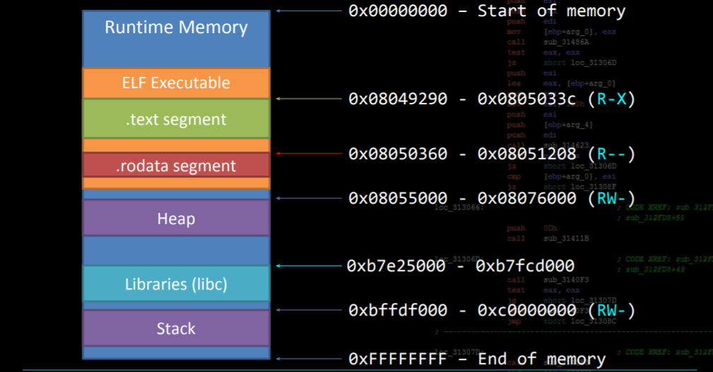

# Pwn & Reversing Introduction Workshop Notes

#### Author: canopus
#### Date: 12/07/2021

---
### Subjects:
- What is CTF
- What is binary exploitation (aka pwning)
- What is reverse engineering 
- Linux ELFs (Extensible Linkage Format)
  - Dynamic vs Static Linkage
- Security Mitigations
  - NX (Non Executable Memory segments)
  - PIE (Position Indepented Executable)
  - ASLR (Address Space Layout Randomization)
  - RELRO (Relocation Read Only)
  - Stack Canary
- Basic Analysis Methods
  - Static analysis
  - Dynamic analysis
- Tools
  - GDB + helpers
  - Ghidra
  - pwntools library
  - ltrace
  - strace
- Tools Showcase & Demo
  - Simple buffer overflow
    - Static analysis using Ghidra
    - Exploit with and without pwntools
  - Simple reversing challange
    - Solve using static analysis with Ghidra
    - Solve using dynamic analysis with ltrace
- General Workflow

---

## CTF (Capture The Flag)
A competition where contestants have to solve challenges with the sole goal to obtain flags.

## What is binary exploitation (aka pwning)
In a nutshell, exploit a vurnerability in program with the goal to achieve or redirect code execution in a local or remote machine. Many techniques are available.

## What is reverse engineering
Understand the functionality  and working behavior of the given program. Usually the goal of these challanges is to work out a needed password or more generally, some arbitrary needed data (memory location, decryption key, flag itself).

## Linux ELFs (Extensible Linkage Format)

- Sections
  - ```readelf -S no_pie```

  

- __Dynamic vs Static Linkage__

    Dynamic Linkage:

  - ```file no_pie```

  - ```ldd no_pie```

  - ```readelf -r no_pie```

## Security Mitigations
  - __NX (Non Executable Memory segments)__
      
    - Marks a memory segment (such as the stack as non executable). No memory segment should have ```w+x``` permissions.

  - __PIE (Position Indepented Executable)__

    - Creates an offset for the programm's functions and global variables and then maps them at runtime over a random base. See bellow. 
    - If a programm is compiled with ```-no-pie``` argument then the functions and global arguments will stay in the same place.
  
  - __ASLR (Address Space Layout Randomization)__
    - Randomizes the base address of each section (code, data, etc) and also stack and heap.
    - Also randomizes the addresses where libraries are linked, such as ```libc```.
    - ```cat /proc/self/maps```
    - Offsets of functions and symbols in linked libraries remain the __same!__
  
  - __RELRO (Relocation Read Only)__
    - Defines the writeability of the GOT (Global Offset Table). Default is partial.

  - __Stack Canary__
    - A random value pushed onto the stack on a function call and then checked upon returing 
  
## Basic Analysis Methods
  - __Static analysis__
    - Decompilers
    - Disassemblers
    - ```strings```
    - ```readelf```
    - ```objdump```
  - __Dynamic analysis__
    - Getting information about the program at runtime
      - GDB
      - Debuggers
      - emulation
      - ```ltrace```
      - ```strace```
## Tools
  - __GDB + helpers__
  - __Ghidra__
  - __pwntools library__
  - __ltrace__
  - __strace__
  
## __Tools Showcase & Demo__
## __General Workflow__

---
## Documantation:
- [liveOverflow](https://www.youtube.com/channel/UClcE-kVhqyiHCcjYwcpfj9w)
- [stacksmashing](https://www.youtube.com/channel/UC3S8vxwRfqLBdIhgRlDRVzw)
- [ctf101](https://ctf101.org/)
- [pwndbg](https://github.com/pwndbg/pwndbg)
- [gef-gdb](https://github.com/hugsy/gef)
- [pwntools](https://github.com/Gallopsled/pwntools)
- [pwncourse](https://www.notion.so/MSc-CTF-Pwn-9ecbafd7791a413dae7d37a24ec27fb9)
- [Bypassing ASRL](http://security.cs.rpi.edu/courses/binexp-spring2015/lectures/15/09_lecture.pdf)